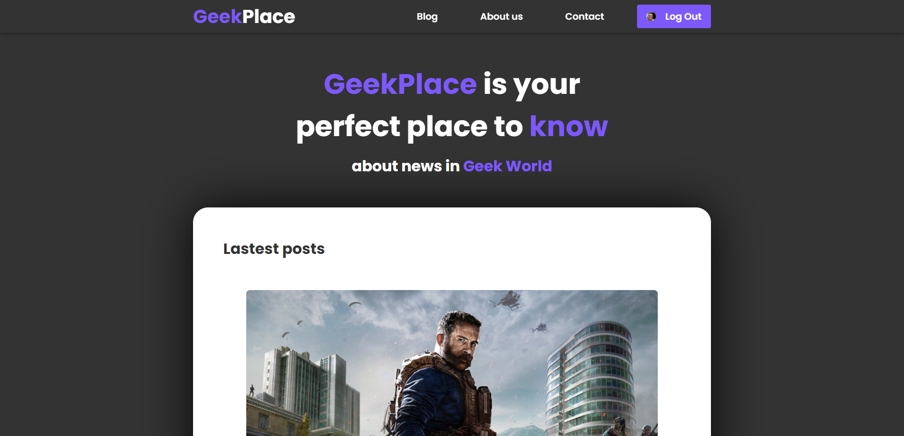

# 👾 GeekPlace

<h2 align="center">
    
</h2>

<h2 align="center">
    
</h2>

Se você se considera GEEK ou é apaixonado por tecnologia assim como eu, o Geekplace é seu lugar perfeito pra interagir.

GeekPlace é um blog com posts sobre tecnologia e sobre o mundo dos games, com as maiores e melhores novidades pra você ficar ligado em tudo que rola nesse ecossistema gigantesco.

## 💻 Tecnologias

O projeto foi desenvolvido usando as tecnologias:
- [ReactJS](https://reactjs.org/)
- [GraphQL](https://graphql.org)
- [Auth0](https://auth0.com/)
- [Vite](https://vitejs.dev/)


## 🚀 Iniciando o Projeto

Clone o projeto e acesse a pasta de desenvolvimento

```bash
$ git clone https://github.com/frazaao/myblog.git && cd myblog
```

Inicie o projeto com os comando abaixo no console
```bash
# Instalando dependencias do projeto
$ yarn

# Iniciar o projeto
$ yarn dev
```

<h3>
    Feito com ❤️ por <a href="https://www.linkedin.com/in/matheus-paula-frazao-5b7284202/">Matheus Paula Frazão</a>
</h3>
